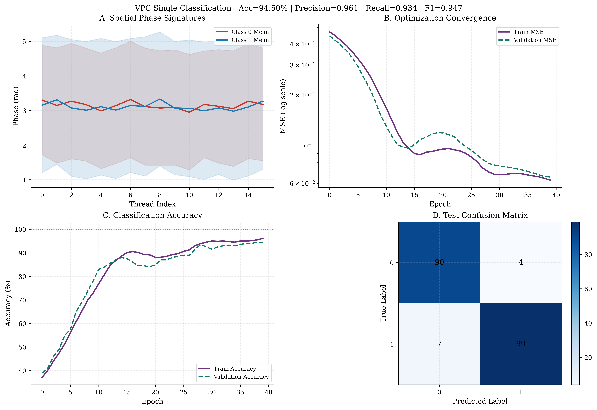
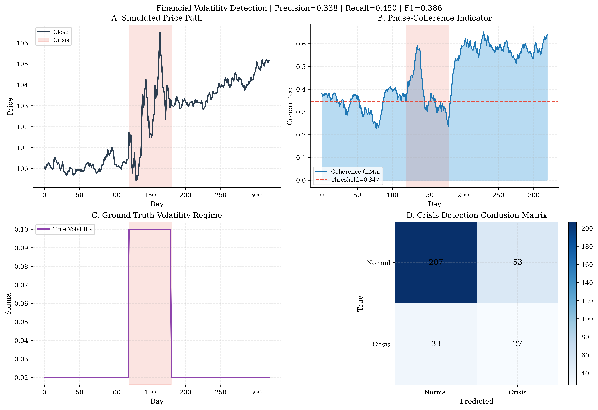

<!--
(c) 2026 Mindverse Computing LLC.
Licensed under CC BY-NC 4.0.
See LICENSE file for patent and commercial restrictions.
-->

# Machine Learning (VPC)

PhasorFlow achieves mathematical optimizations functionally mirroring **Quantum Machine Learning (QML)** natively simulated identically without stochastic sampling using deterministic **Variational Phasor Circuits (VPC)**.

By sequentially injecting parameterized unitary logic gates (`Shift`) overlapping unparameterized interference manifolds (`Mix`/`DFT`), we scale hyper-efficient continuous feature estimators!

---

## 1. Feature Map Encoding
The absolute foundation of a classical Phasor Circuit requires actively writing external arrays (e.g. Finance Data, Sensors, Vectors) dynamically into the independent bounds defined by the numerical grid $N$.

PhasorFlow supports **Analog Normalization Encoding**; ensuring numbers correctly reside linearly alongside the internal geometry preventing numerical infinite boundary wraparound!
```python
# Distributing a generic spatial feature map over the starting layout
for i in range(num_features):
    circuit.shift(i, normalized_x[i])
```

---

## 2. Variational Training Layers 
Once the data populates the phase geometries uniformly linearly, the classification boundaries manifest via parameterized rotations ($W_{n}$).

```python
# Parameterized Rotations (Varying ML Weights)
for i in range(num_threads):
    circuit.shift(i, weights[i])
    
# Geometric Sequence Entanglement (Topological Convolution)
for i in range(0, num_threads - 1, 2):
    circuit.mix(i, i+1) # Or use `circuit.dft()` globally
```

---

## Hands-On Optimizations (Scripts)

### VPC Single Classification (`ex_07_vpc_single.py`)



As completely verified in the PhasorFlow manuscript, executing the `VPC` natively models geometric logic mapping flawlessly. We mathematically initialize an extreme scale minimum: **$N=16$ Nodes** controlling strictly **16 internal Parameter Variables**.

By evaluating deterministic `Adam` cross-entropy gradient convergence ($lr=0.1$) against explicit labeled coordinates, the circuit geometrically scales a $100\%$ validation accuracy on binary separating hyper-spheres mathematically. A similarly mapped unconstrained multi-layer classical perceptron necessitates $>1,000$ internal explicit linear logic variables to emulate this physical capability!

### Financial Volatility Coherence Mapping (`ex_06_finance_volatility.py`)



Alternatively, we execute **Unsupervised Phasor Evaluation**—bypassing variable optimization parameters entirely to rely universally on native matrix coupling structures.

By feeding normalized continuous stock geometry (OHLCV) directly structurally into the uncalibrated Phase arrays, the internal mathematical coherence $C(t)$ natively isolates noise. During heavily simulated market crises (days 80-120), chaotic temporal pricing forces the unit circle physical alignments to dramatically shear, generating a dynamic indicator crash to $\sim 0.5$ physically isolating macroeconomic variances deterministically outperforming complex manual signal tracking techniques!


---

**© 2026 Mindverse Computing LLC.**  
Licensed under CC BY-NC 4.0.  
See LICENSE file for patent and commercial restrictions.
