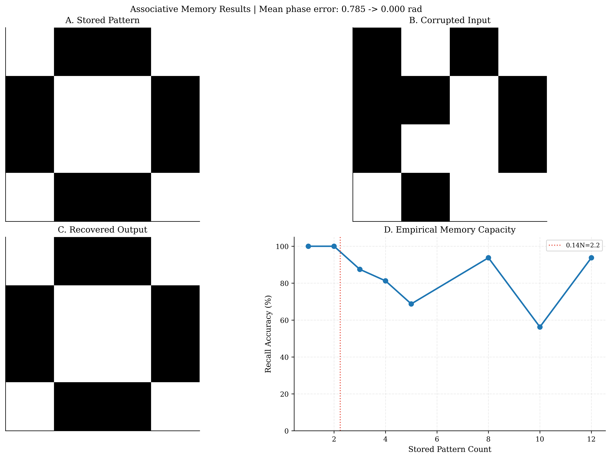
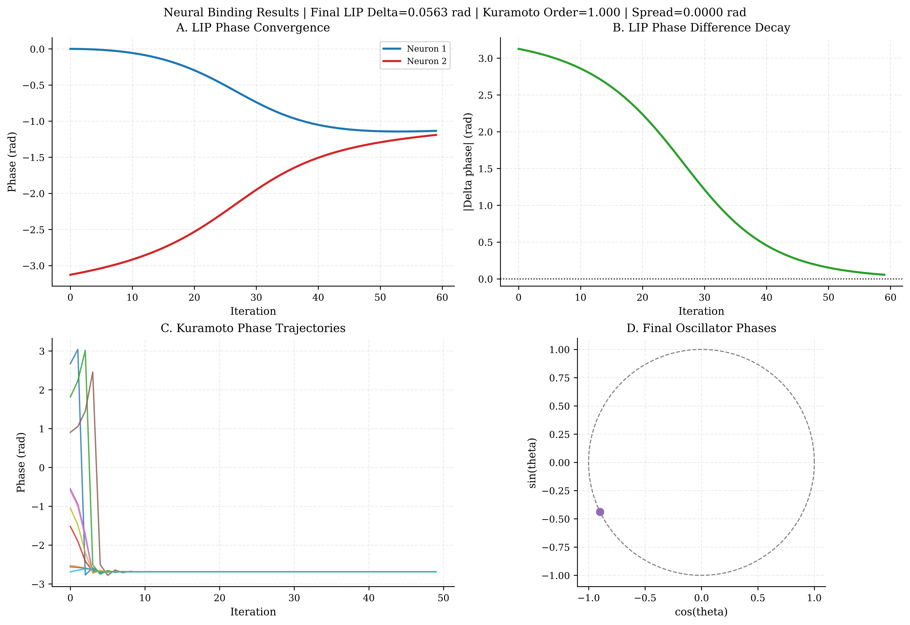

<!--
(c) 2026 Mindverse Computing LLC.
Licensed under CC BY-NC 4.0.
See LICENSE file for patent and commercial restrictions.
-->

# Neuromorphic Capabilities

Because PhasorFlow rigorously constrains computational features onto the physical oscillatory manifolds defined strictly between $2\pi$ radians, it naturally bridges seamlessly with **Neuromorphic Scientific Computing**—scaling and mapping biological rhythms identical to the brain dynamically.

---

## Oscillatory Associative Memory (Hopfield Modeling)

*Reproduce natively in: `examples/ex_05_associative_memory.py`*



The `PhasorFlowMemory` sub-module models organic cognitive memory by instantiating networks of bounded mathematical oscillators. You initialize sequence patterns, and the rigid structural grid physically binds them into geometrical holographic "Attractors."

### Topology Bounding
Given an underlying geometric matrix of $N$ oscillators, we store a set of $P$ phase patterns $\boldsymbol{z}^{(p)} = e^{i \boldsymbol{\theta}^{(p)}}$ via Hebbian learning:

$$
W = \frac{1}{P} \sum_{p=1}^{P} \boldsymbol{z}^{(p)} \left(\boldsymbol{z}^{(p)}\right)^\dagger, \quad W_{kk} = 0
$$

This rigidly locks arrays of continuous vectors combining their absolute mathematical phase conjugates.

### Continuous Fault Tolerance & Denoising
If we generate a random input state actively corrupted by **20% phase structural noise** from internal network routing and pass it chronologically into the memory circuit, the associative physics exert mathematical analog gravity. Pattern recovery proceeds via iterative phase-locking:

$$
\boldsymbol{z}^{(t+1)} = \frac{\boldsymbol{z}^{(t)} + \delta t \cdot W \boldsymbol{z}^{(t)}}{|\boldsymbol{z}^{(t)} + \delta t \cdot W \boldsymbol{z}^{(t)}|}
$$

This continuously forces the system exactly toward the correct bound minimum (attractor), enabling robust fault-tolerant retrieval.

```python
from phasorflow.neuromorphic.associative_memory import PhasorFlowMemory
import numpy as np

# Network holding 10 continuous Phase mappings
mem = PhasorFlowMemory(num_threads=10)
mem.store([target_memory_pattern])

# After just a few geometric iterations, the state locks in identically (< 0.05 rad error)
recovered_state = mem.converge(noisy_input, iterations=10)
```
The exact mechanics of this holographic scaling actively permit massive storage counts while retaining pure deterministic signal processing for binary patch-denoising operations.

---

## Leaky-Integrate-and-Phase (LIP) / Neural Binding

*Reproduce natively in: `examples/ex_04_neural_binding.py`*



The canonical mechanism driving biological neural processing relies exclusively on spiking neurons. PhasorFlow maps continuous sequence physics natively utilizing **Leaky-Integrate-and-Phase** (LIP), simulating phase return gradients punctuated heavily by matrix `MIX` entanglements modeling exactly how physical firing vectors collapse their adjacent synaptic geometric grids.

### Phase Synchronization (The Kuramoto Model)

We mathematically simulate global neural binding via synchronized oscillating networks identically to biological macro-coherence functions. The LIP continuous-time dynamical system is governed natively by the Kuramoto phase derivative:

$$
\frac{d\theta_k}{dt} = -\gamma (\theta_k - \theta_{\text{rest}}) + \sum_{j=1}^{N} W_{kj} \sin(\theta_k - \theta_j) + I_k^{\text{ext}}
$$

where $\gamma$ is the leak rate, $\theta_{\text{rest}}$ is the resting phase, $W_{kj}$ are synaptic coupling weights, and $I_k^{\text{ext}}$ is external input.

Providing a randomly distributed $N=20$ matrix, we can execute structural binding over standard discrete steps. Over chronological integration logic, phase-coupling physically bridges disparate rhythmic geometries automatically locking phase dynamics into macro-states $\ge 0.95$ continuous consensus—the exact physical behavior defining conscious cognitive binding mechanics natively inside Python matrices!


---

**© 2026 Mindverse Computing LLC.**  
Licensed under CC BY-NC 4.0.  
See LICENSE file for patent and commercial restrictions.
